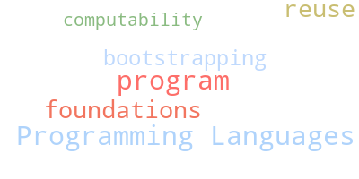

<!-- SPDX-FileCopyrightText: 2026 Oscar Bender-Stone <oscar-bender-stone@protonmail.com> -->
<!-- SPDX-License-Identifier: LicenseRef-Proprietary -->

# About

{alt="Professional Headshot" .circle-image}

**University of Iowa**

Address: TBD

**Email:** [obenderstone@uiowa.edu](mailto:obenderstone@uiowa.edu)

Hello! I am an incoming graduate student at the
[University of Iowa](https://cs.uiowa.edu) advised by
[Garrett Morris](https://jgbm.github.io).

I study Programming Languages. Specifically, I'm working on
[**program reuse**](program-reuse) and [**bootstrapping**](bootstrapping). I
like to incorporate theoretical ideas, especially from mathematical logic and
computability theory.

## Previous Affilations

I earned my undergraduate degree at the
[University of Colorado at Boulder](https://www.colorado.edu); I worked in the
[CUPLV Lab](https://plv.colorado.edu) and the
[Math department](https://www.colorado.edu/math/).

## Interests

{alt="Interests wordcloud."}\

